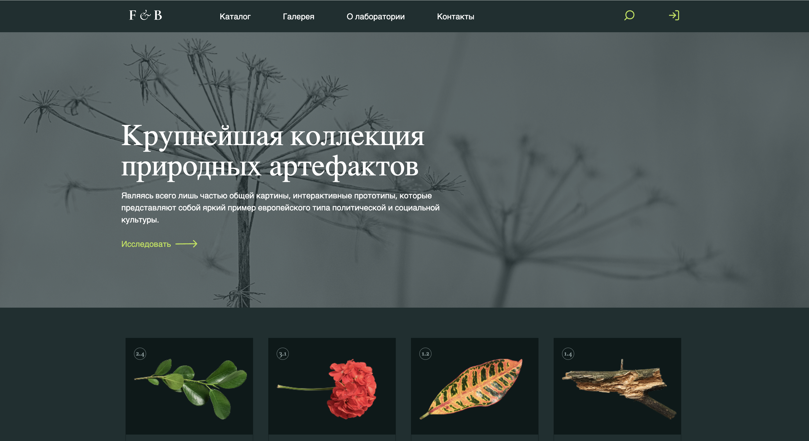

# 🌸 Flower Landing

| Десктоп | Мобильная версия |
|--------|------------------|
|  |  |

Учебный одностраничный сайт с адаптивной версткой и подключением слайдера. Проект выполнен вручную без шаблонов, с акцентом на чистую структуру и понимание основ.

## 🚀 Демо

[Открыть сайт на GitHub Pages](https://nigina005.github.io/flower-landing/)

## 🛠 Используемые технологии

- HTML5, CSS3 (`reset.css`)
- JavaScript
- Slick.js (подключение вручную)

## 💡 Что я для себя подчеркнула

- Впервые реализовала **бургер-меню**, которое срабатывает при переходе на мобильную версию.
- Адаптив лучше делать сразу — откладывание усложняет доработку.
- Больше практики и теории особенно с интерактивными элементами

